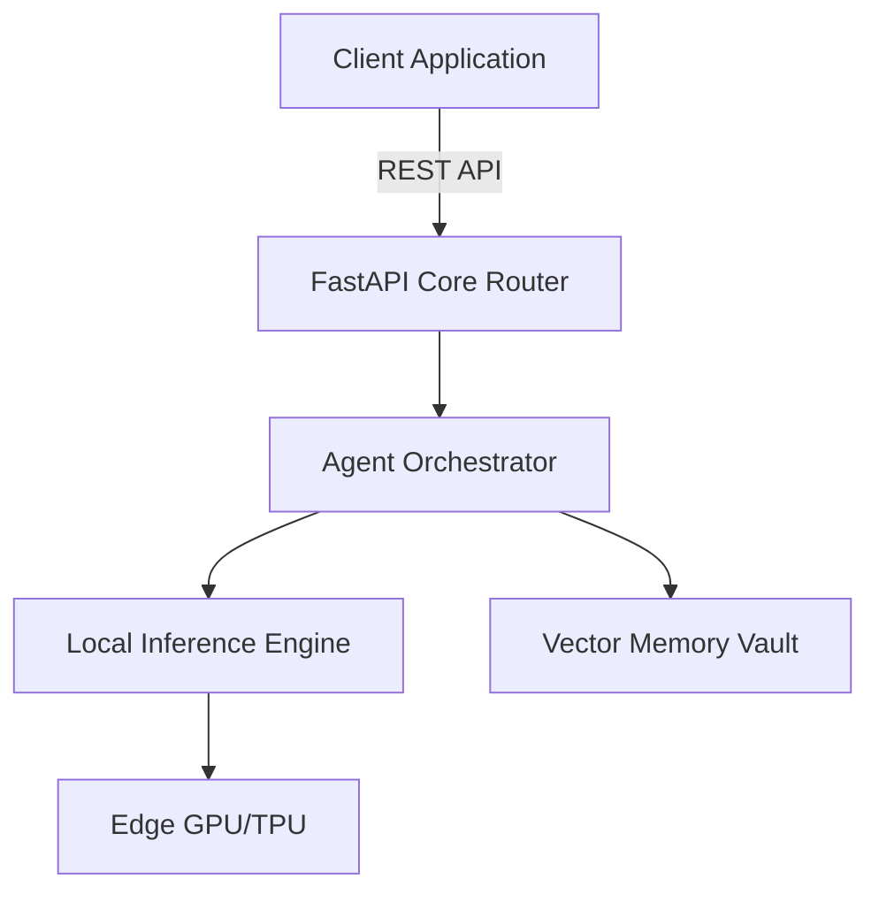

<div align="center">
  <h1>🌌 Lullaby Engine</h1>
  <p><b>Next-Generation Autonomous Agentic System & Local Inference Edge Engine</b></p>

  
  
  
  
</div>

<br>

---

## ⚡ Executive Summary

The **Lullaby Engine** represents a paradigm shift in how autonomous AI agents are deployed. By moving inference entirely to the edge, the Lullaby Engine completely eliminates the latency, cost, and privacy vulnerabilities associated with relying on third-party cloud LLM APIs. 

If you are building autonomous systems that handle highly sensitive proprietary data, this architecture guarantees that your intelligence never leaves your physical hardware.

## 🏗️ Architecture Overview

The engine is built on top of a highly optimized **FastAPI** core, providing asynchronous task execution for local agents.



## ✨ Core Capabilities

*   **Zero-Latency Inference:** Direct hardware-level execution removes network overhead.
*   **Absolute Privacy:** Perfect for enterprise environments. No data is ever transmitted externally.
*   **Modular Agentic Workflows:** Easily attach custom tools, chains, and memory modules.
*   **Production-Ready:** Ships with pre-configured CI/CD pipelines, test suites, and strict dependency management.

---

## 🚀 Quick Start Guide

### Prerequisites
*   Python 3.10 or higher
*   (Optional) NVIDIA GPU with CUDA for accelerated local inference.

### 1. Installation

Clone the repository and use the built-in Makefile to install dependencies instantly:
```bash
git clone https://github.com/lakshanmuruganandam/lullaby-engine.git
cd lullaby-engine

# Installs all required dependencies (FastAPI, Uvicorn, Pytest)
make install
```

### 2. Run the Engine

Launch the highly optimized ASGI server:
```bash
make run
```
The API will be available at `http://127.0.0.1:8000`. You can interact with the auto-generated Swagger UI documentation at `http://127.0.0.1:8000/docs`.

### 3. Run the Test Suite

We enforce strict reliability. Run the test suite using `pytest`:
```bash
make test
```

---

## 📖 API Reference

### Health Check
Verify the engine is operational on edge hardware.
*   **URL:** `/health`
*   **Method:** `GET`
*   **Response:**
    ```json
    {
      "status": "ok",
      "message": "Engine is running flawlessly on edge."
    }
    ```

### Execute Agent Task
Trigger a background autonomous agent operation.
*   **URL:** `/api/v1/execute`
*   **Method:** `POST`
*   **Body:** `{"task": "Analyze local logs for anomalies"}`

---

## 🤝 Contributing

We welcome contributions! Please follow our strict CI guidelines:
1. Fork the repository.
2. Create your feature branch (`git checkout -b feature/AmazingFeature`).
3. Ensure all tests pass (`make test`).
4. Commit your changes (`git commit -m 'feat: add some AmazingFeature'`).
5. Push to the branch (`git push origin feature/AmazingFeature`).
6. Open a Pull Request.

## 📝 License

Distributed under the MIT License. See `LICENSE` for more information.
